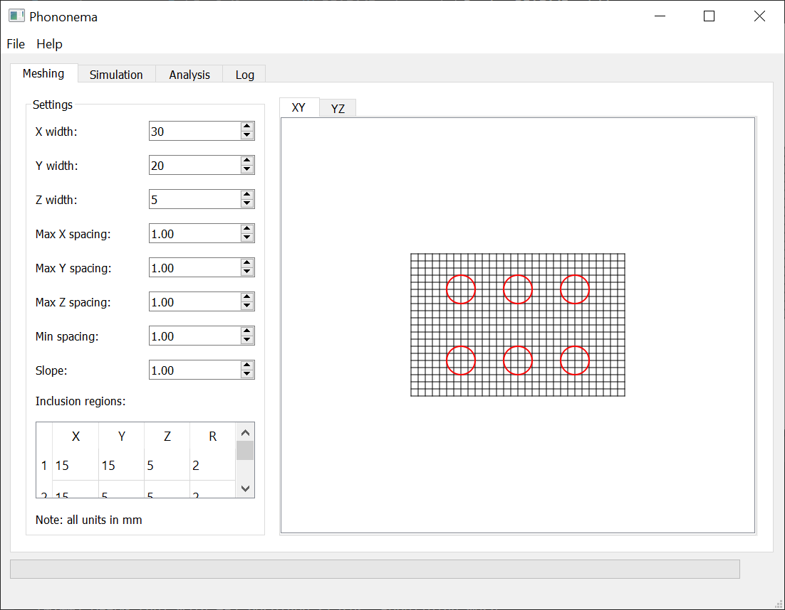
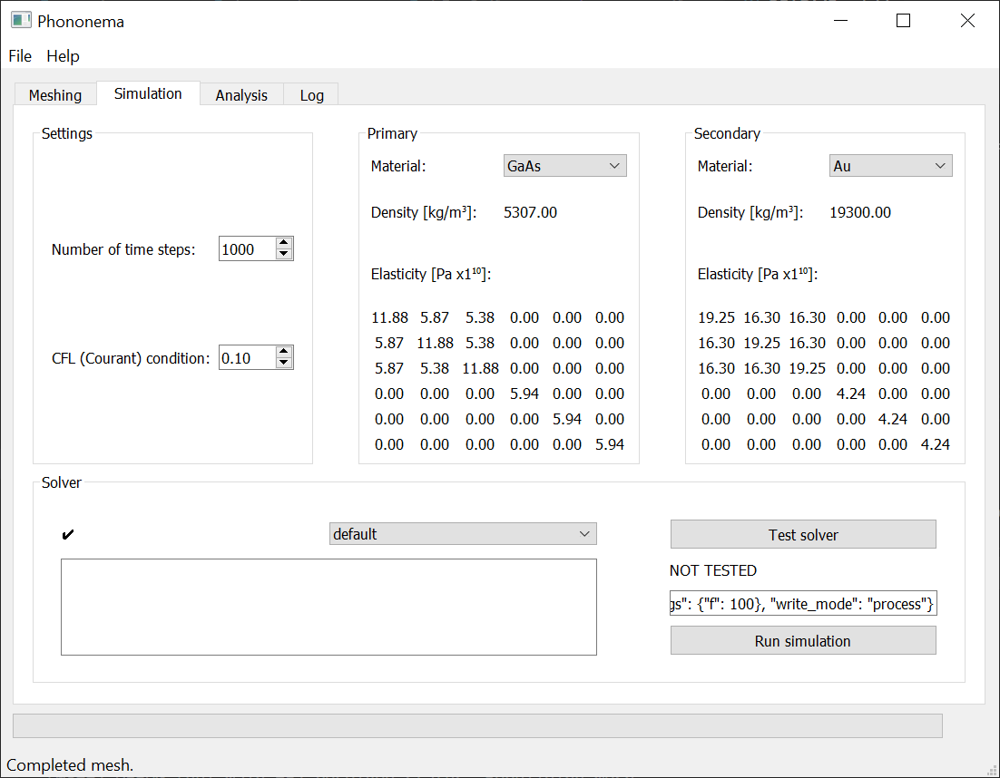
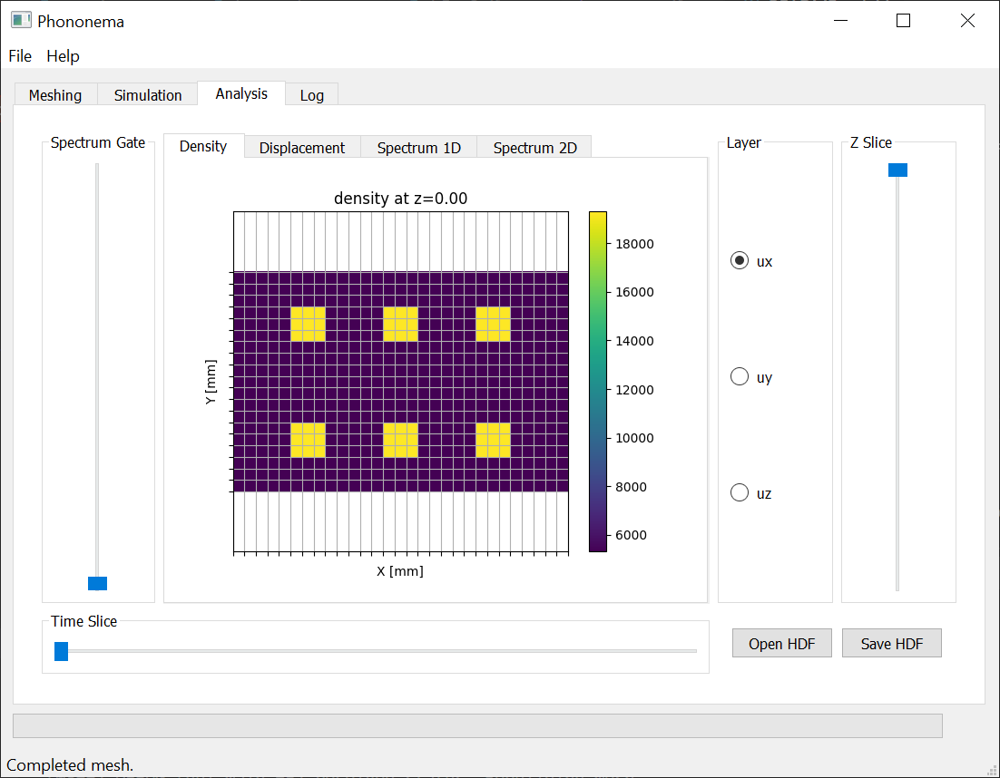
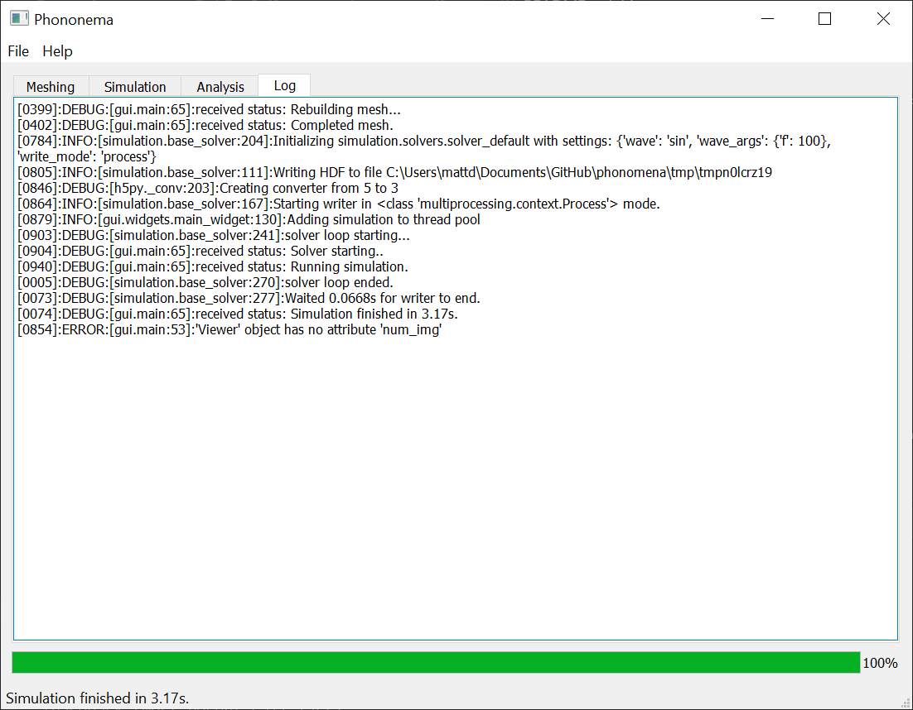
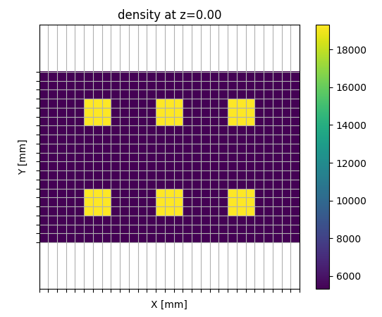

# *Phonomena FDTD Acoustic Wave Simulator*
### *Queen's University ENPH Undergraduate Thesis*

This project is a Python based FDTD simulation tool for acoustic wave transmission in phononic crystals. It is designed to be flexible and simple to use, while allowing for significant future extensions or use as a solver in other software.

## Getting Started

Released versions of this software can be downloaded from this repository as bundled a single folder application. This includes the Python environment and all necessary libraries listed in requirements.txt.

The application can alternatively be imported as a Python package and run from a script, allowing for automated tests or extending the software as needed.

## Installing for Development
Clone to repository:

`git clone https://github.com/matt-duke/phonomena.git`

Using Python 3 (tested on 3.8.2), install the dependencies with the Python package  from the repository folder:

`pip install -r requirements.txt`

That's it! The GUI application can now be run using \_\_main\_\_.py.

More information on continuing development is available in the docs folder.

## Authors
Phonomena was extended by Matt Duke from previous work by Marc Cameron. It is the product of my 2020 ENPH undergraduate thesis.

## Screenshots

## Example Output
Example simulation using default settings. The image on the right shows vetical displacement on the surface over time, with a z-wise sinusoidal input applied at the left wall.

